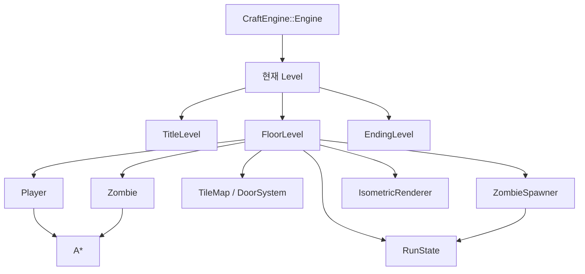
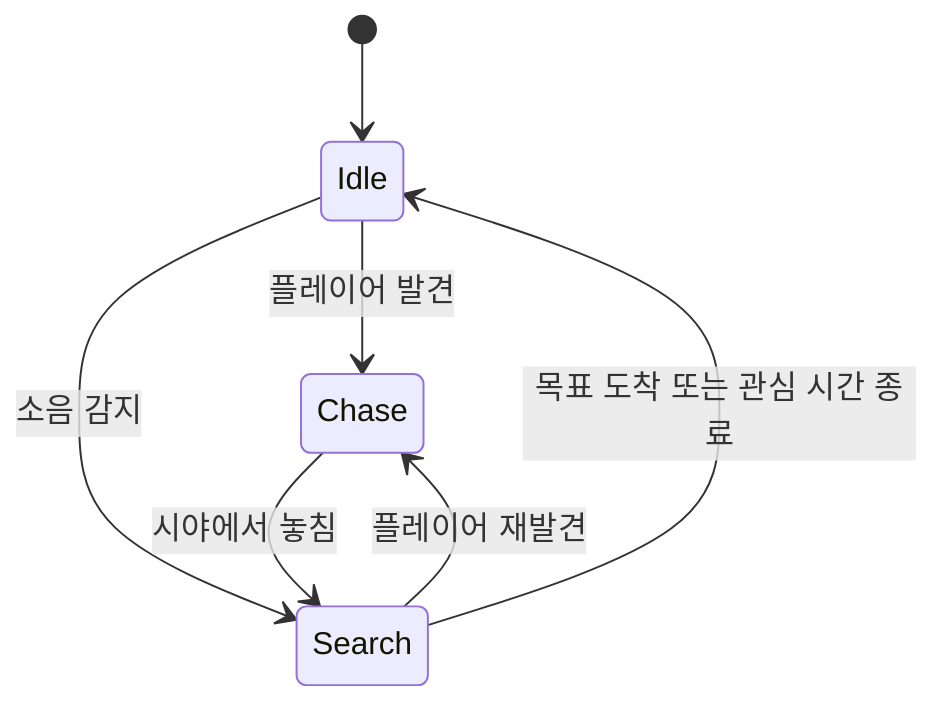

# NO WAY DOWN 기술 결과 보고서

> C++20과 Windows 콘솔 환경에서 구현한 12층 좀비 생존 게임

- 작성일: 2026년 9월 28일
- 개발 환경: C++20, Windows API, Visual Studio, x64
- 프로젝트 구성: `CraftEngine` 동적 라이브러리 + `NoWayDown` 실행 프로그램

## 1. 프로젝트 개요

`NO WAY DOWN`은 제한된 체력과 탄약을 관리하며 좀비를 피해 건물 12개 층을 올라가는 콘솔 생존 게임이다. 플레이어는 근접 공격과 총을 선택해 싸울 수 있고, 문과 시야, 소음, 층을 따라오는 좀비가 매 순간의 이동 경로에 영향을 준다.

프로젝트의 목표는 다음과 같다.

1. `Engine → Level → Actor` 구조를 실제 게임 흐름에 적용한다.
2. A* 경로 탐색과 유한 상태 기계를 결합해 추격 AI를 구현한다.
3. 레벨이 교체되어도 플레이 상태가 이어지는 구조를 만든다.
4. Windows 콘솔의 제한된 색상과 문자 셀로 읽기 쉬운 2.5D 화면을 표현한다.

`CraftEngine`의 기본 구조는 원티드 포텐업 게임개발트랙 강의 과정을 기반으로 학습하고 구현했다. 그 위에 `NoWayDown`의 전투, 좀비 AI, 층간 진행, 시야, 문, 지도, 아이소메트릭 렌더링을 구성했다.

## 2. 결과 요약

| 구분 | 구현 결과 |
|---|---|
| 게임 진행 | 12개 맵, 층 전환, 게임 오버, 12층 클리어 |
| 플레이어 | 키보드·마우스 이동, 근접 공격, 총, 회복약 |
| 좀비 AI | 대기·추격·수색 상태, 시야 판정, 소음 반응, A* 이동 |
| 환경 상호작용 | 문 열기, 좀비의 문 공격과 파괴, 벽·문 시야 차단 |
| 층간 상태 | 체력·회복약·탄약 유지, 추격 좀비의 지연 등장 |
| 화면 | 회전 가능한 아이소메트릭 화면, 카메라 추적, 4방향 3프레임 스프라이트 |
| 사용자 정보 | HUD, 전체 지도, 시야와 탐색 기록, 디버그 표시 |
| 오디오 | BGM, 이동·공격·위험·문·층 전환 효과음 |

## 3. 전체 구조



### `CraftEngine`

- `Engine`: 입력 처리, 프레임 시간 계산, `Tick`과 `Draw`, Level 교체를 담당한다.
- `Level`: Actor 목록을 관리하고 각 Actor의 갱신과 그리기를 호출한다.
- `Actor`: Player와 Zombie가 공유하는 위치, 활성 상태, Owner 관계를 제공한다.
- `Renderer`: 프레임의 출력 요청을 모은 뒤 콘솔 버퍼에 기록한다.

Actor의 생성과 삭제는 순회 중 목록을 바로 바꾸지 않고 요청 목록에 모아 프레임 끝에 반영한다. 이 방식으로 반복자 무효화와 같은 순회 중 변경 문제를 피했다.

### `NoWayDown`

- `FloorLevel`: 한 층의 맵, 시야, 전투, 소음, 카메라와 층 전환을 조정한다.
- `Player`: 입력, 이동, 공격과 아이템 사용을 담당한다.
- `Zombie`: 상태 판단, 경로 탐색, 문 공격과 플레이어 공격을 담당한다.
- `RunState`: Level 교체 후에도 유지해야 하는 진행 데이터를 보관한다.
- `IsometricRenderer`: 월드 좌표를 화면 좌표로 바꾸고 타일과 벽, 캐릭터를 그린다.

## 4. 핵심 기술 구현

### 4.1 프레임 갱신과 Level 교체

엔진은 고해상도 타이머로 `deltaTime`을 구하고 설정한 프레임 간격마다 다음 순서로 실행한다.

```text
입력 처리 → 초기화 → Tick → Draw → Level 교체 → Actor 추가·삭제 반영
```

새 Level은 `nextLevel`에 먼저 생성한다. 현재 프레임의 갱신과 그리기가 끝난 뒤 `mainLevel`과 교체하므로, 실행 중인 Level을 즉시 제거해서 생길 수 있는 수명 문제를 피했다. 게임 창이 포커스를 잃으면 시뮬레이션과 출력을 잠시 멈춰 다른 창에서 누른 키가 게임 입력으로 처리되지 않게 했다.

### 4.2 Level과 분리한 진행 상태

`FloorLevel`은 층이 바뀔 때마다 새로 생성된다. 체력과 탄약을 Level 안에 두면 교체 시 함께 사라지므로 별도의 `RunState`에 다음 데이터를 저장했다.

- 현재 층
- 체력, 회복약, 탄약
- 게임 오버와 클리어 상태
- 다음 층으로 이동 중인 좀비 정보
- 층 전환에 사용하는 직전 화면과 타이머

새 `FloorLevel`에 같은 `shared_ptr<RunState>`를 전달해 진행 정보를 이어 간다. Level은 Actor를 `shared_ptr`로 소유하고, Actor는 Owner Level을 `weak_ptr`로 참조해 순환 소유도 피했다.

### 4.3 A* 경로 탐색

Player의 마우스 이동과 Zombie의 이동에 4방향 A*를 사용한다.

```text
g = 시작점부터 현재 칸까지 실제 비용
h = 현재 칸부터 목적지까지의 맨해튼 거리
f = g + h
```

열린 목록에서 `f`가 가장 작은 노드를 선택하고, 값이 같으면 목적지에 더 가까운 `h`가 작은 노드를 우선한다. 각 노드는 부모 노드를 기억하며 목적지에 도착하면 부모를 거꾸로 따라간 뒤 순서를 뒤집어 이동 경로를 만든다.

일반 바닥의 이동 비용은 낮게, 닫힌 문의 비용은 높게 두었다. Zombie는 우회로가 짧으면 우회하고, 우회 비용이 더 크면 문을 부수는 경로를 선택할 수 있다. Player의 경로 탐색에서는 닫힌 문을 통과할 수 없게 해 같은 알고리즘을 서로 다른 이동 규칙에 사용했다.

### 4.4 Zombie 상태 기계와 감각

Zombie 행동은 세 상태로 나뉜다.



플레이어와의 맨해튼 거리가 감지 범위 안이고 벽이나 닫힌 문에 가리지 않을 때만 `Chase`로 전환한다. 플레이어가 보이는 동안에는 목표 위치와 관심 시간을 계속 갱신한다. 시야에서 놓치면 마지막 목격 위치를 `Search`하고, 목표에 도착하거나 관심 시간이 끝나면 `Idle`로 돌아간다.

문 열기와 총성은 위치와 범위를 가진 소음을 만든다. 범위 안의 Zombie는 해당 위치를 수색 목표로 삼는다. 이미 플레이어를 직접 추격 중이라면 시각 정보를 우선해 기존 추격을 유지한다.

### 4.5 문과 추격 경로의 결합

닫힌 문은 이동과 시야를 모두 막는다. Zombie의 다음 경로가 닫힌 문이면 그 칸으로 이동하지 않고 문을 공격한다. 일정 횟수 공격하면 잠시 쉬며, 누적 타격 수가 기준에 도달하면 문 타일을 바닥으로 바꾼다. 문이 파괴되면 시야 계산을 다시 수행하고 A*가 새 경로를 찾는다.

이 구조는 문을 단순한 장애물로만 두지 않고 다음 선택을 만드는 게임 규칙으로 연결한다.

- Player: 문을 열어 빠르게 이동할 수 있지만 소음이 발생한다.
- Zombie: 우회하거나 문을 공격할 수 있다.
- 시야: 닫힌 문은 가리고 열린 문은 통과시킨다.

### 4.6 층을 따라오는 Zombie

출구에 들어가면 현재 층의 활성 Zombie 중 다음 조건을 만족하는 대상을 고른다.

1. 추격 또는 수색 상태이며 관심 시간이 남아 있다.
2. A*로 플레이어 위치까지 실제 도달할 수 있다.
3. 최초 추격 층에서 허용한 층 수 이상 멀어지지 않았다.

선택한 Zombie의 체력, 최초 추격 층, 목적 층과 도착 지연을 `ZombieData`로 저장한다. 다음 층에서는 도착 시간을 줄이다가 시간이 끝나면 계단 주변의 빈 칸을 찾아 생성한다. 플레이어가 도착 전에 다시 다음 층으로 이동하면 목적 층과 지연 시간을 갱신한다.

### 4.7 시야와 탐색 기록

타일마다 다음 정보를 구분해 저장한다.

- 현재 보이는가
- 한 번이라도 본 적이 있는가
- 현재 밝기는 얼마인가

플레이어가 다른 칸으로 이동했을 때만 시야선을 다시 계산해 불필요한 반복을 줄였다. 현재 보이는 칸은 원래 색, 이전에 본 칸은 미리 정한 어두운 팔레트 색으로 표시하고, 본 적 없는 칸은 그리지 않는다. 전체 지도에서도 이 탐색 기록을 사용한다.

### 4.8 아이소메트릭 콘솔 렌더링

`IsometricRenderer`는 카메라를 기준으로 한 월드 좌표에 회전 행렬을 적용한 뒤 화면 중심과 확대 비율을 더해 화면 좌표로 바꾼다. 반대로 마우스 클릭은 역회전을 적용해 화면 좌표를 맵 타일 좌표로 되돌린다.

바닥은 사각형을 두 개의 삼각형으로 나누어 채우고, 벽은 윗면과 노출된 앞면을 따로 그려 높이를 표현한다. 카메라 각도에 따라 먼 타일부터 정렬해 그려 가까운 벽이 자연스럽게 앞을 가리도록 했다. 실제 충돌 좌표는 정수 타일에 유지하면서 별도의 실수형 시각 좌표가 실제 위치를 따라오게 해 이동과 카메라가 부드럽게 보이도록 했다.

캐릭터는 4방향 × 3프레임의 16색 인덱스 스프라이트로 출력한다. 일부 스프라이트 원화는 AI 이미지 생성 도구로 제작했으며, 게임에서는 콘솔 렌더러용 데이터로 변환한 프레임을 사용한다.

## 5. 주요 문제와 해결

| 문제 | 원인 | 해결 |
|---|---|---|
| 층 교체 시 체력과 아이템이 초기화됨 | 진행 데이터를 `FloorLevel`이 소유함 | `RunState`를 분리하고 다음 Level에 같은 포인터 전달 |
| Actor 순회 중 추가·삭제 위험 | `vector`를 순회하면서 구조를 변경할 수 있음 | 추가 요청과 삭제 표시를 모아 프레임 끝에 반영 |
| 출구에 들어간 프레임에 피해를 받음 | Level 교체 예약 후 남은 Zombie Tick이 계속 실행됨 | `floorTransitionRequested` 동안 피해 차단 |
| 마우스 첫 이동만 빠르게 보임 | 대기 중 누적된 이동 타이머가 클릭 경로에 즉시 적용됨 | 새 클릭 경로를 받을 때 `moveTimer` 초기화 |
| 실행 폴더에 따라 설정과 맵을 찾지 못함 | 현재 작업 폴더 기준 상대 경로 사용 | 실행 파일 기준으로 리소스 경로를 탐색하고 설정 실패 시 기본값 사용 |
| 타일 이동과 카메라가 끊겨 보임 | 논리 좌표가 칸 단위로 즉시 변경됨 | 렌더링 전용 실수 좌표가 논리 좌표를 보간하도록 분리 |
| 문 뒤의 추격이 단순하게 멈춤 | A*가 문과 전투 규칙을 함께 고려하지 못함 | 닫힌 문에 높은 비용을 부여하고 Zombie의 문 공격과 연결 |

## 6. 구현 결과 검증

| 검증 항목 | 확인 내용 |
|---|---|
| 빌드 | x64 Debug와 x64 Release 구성 빌드 확인 |
| 기본 진행 | 타이틀에서 시작해 층 이동, 게임 오버, 재시작, 12층 클리어 확인 |
| 입력 | 방향키 이동, 마우스 경로 이동, 공격, 지도, 카메라 회전 확인 |
| AI | 발견·추격·수색·포기, 소음 반응, 문 공격과 파괴 확인 |
| 층간 상태 | 체력·회복약·탄약 유지와 추격 Zombie의 지연 등장 확인 |
| 실행 경로 | 실행 위치와 관계없이 설정·맵·오디오 리소스 탐색 확인 |

## 7. 한계와 향후 계획

- 12층 이후 옥상 장면과 탈출 연출을 추가할 수 있다.
- 현재 수작업 맵을 방·복도 템플릿 기반 생성 방식으로 확장할 수 있다.
- 소음과 층 체류 시간이 다음 층의 위험도에 영향을 주도록 발전시킬 수 있다.
- Zombie가 많아질 경우 A*의 선형 열린 목록 탐색을 우선순위 큐로 바꾸고 탐색 결과를 재사용할 수 있다.
- 게임 상태 갱신을 고정 틱으로 분리하면 PC 성능에 따른 시뮬레이션 차이를 더 줄일 수 있다.
- `FloorLevel`에 모인 시야, 전투, 전환 조정 책임을 별도 시스템으로 나누면 유지보수가 쉬워진다.

## 8. 학습 결과

이 프로젝트를 통해 개별 기능 구현보다 기능 사이의 연결이 게임의 동작을 결정한다는 점을 확인했다. A*는 경로만 반환하지만 상태 기계, 문 비용, 소음과 결합했을 때 추격 행동이 되었고, `RunState`는 단순한 데이터 구조지만 Level 교체와 Zombie 생성 시점을 연결해 층간 진행을 만들었다.

또한 논리 좌표와 시각 좌표, 현재 Level과 다음 Level, Actor 소유와 Owner 참조를 분리하면서 각 데이터의 수명과 변경 시점을 명확하게 관리하는 방법을 익혔다. 이후에는 `FloorLevel`의 역할을 더 작은 시스템으로 나누고 측정 가능한 성능 지표를 추가하는 방향으로 개선할 계획이다.

## 9. 주요 코드 위치

- [`CraftEngine/Engine/Engine.cpp`](CraftEngine/Engine/Engine.cpp): 메인 루프와 Level 교체
- [`CraftEngine/Level/Level.h`](CraftEngine/Level/Level.h): Actor 소유와 생성 예약
- [`NoWayDown/Level/FloorLevel.cpp`](NoWayDown/Level/FloorLevel.cpp): 게임 진행과 시스템 조정
- [`NoWayDown/Actor/Player.cpp`](NoWayDown/Actor/Player.cpp): 입력, 이동과 전투
- [`NoWayDown/Actor/Zombie.cpp`](NoWayDown/Actor/Zombie.cpp): Zombie 상태와 행동
- [`NoWayDown/PathFinding/AStar.cpp`](NoWayDown/PathFinding/AStar.cpp): 4방향 A* 경로 탐색
- [`NoWayDown/Game/RunState.h`](NoWayDown/Game/RunState.h): 층간 진행 데이터
- [`NoWayDown/Game/ZombieSpawner.cpp`](NoWayDown/Game/ZombieSpawner.cpp): 맵 배치와 층간 추격
- [`NoWayDown/Renderer/IsometricRenderer.cpp`](NoWayDown/Renderer/IsometricRenderer.cpp): 좌표 변환과 2.5D 출력

## 10. 에셋 출처

- 사운드: [AMIX 8-bit sound tools](https://amix-design.com/tl/tool-s-8bit-env/)
- 캐릭터 스프라이트: 일부 원화에 AI 이미지 생성 도구를 사용하고 콘솔용 16색 인덱스 프레임으로 변환
